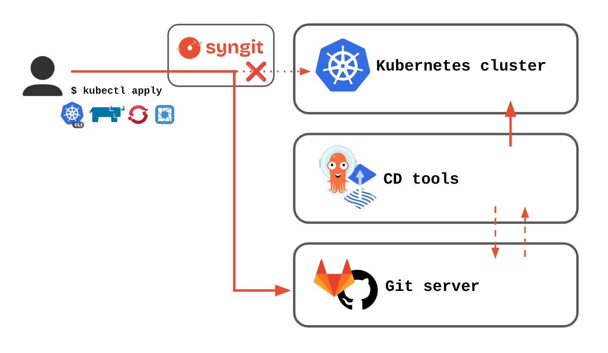

<p align="center" style="margin-bottom: -20px">
  
</p>
<p align="center">
  
</p>

Syngit is a Kubernetes operator that allows you to push resources on a git repository and manage their lifecycle. It leverage the gitops by unifying the source of truth between your cluster and your git repository. It acts as a proxy between your client tool (`kubectl`, `oc` or any UI) and the cluster.

----


## Quick start

### Prerequisites
- Helm version v3.0.0+.
- Cert Manager version 1.13+ on the cluster.
- Access to a Kubernetes v1.11.3+ cluster.

### Installation

1. Add the helm repo
```sh
helm repo add syngit https://syngit-org.github.io/syngit
```

2. Install the operator
```sh
helm install syngit syngit/syngit --version 0.1.1 -n syngit --create-namespace
```

syngit is now installed on the cluster! More information about the configuration can be found on the [wiki](https://github.com/syngit-org/syngit/wiki/Installation).

## Use syngit

### RemoteUser

The RemoteUser object does the connexion to the remote git server using a git user account. In order to use this object, we first need to create a secret that reference a Personal Access Token (and not an Access Token).

```yaml
apiVersion: v1
kind: Secret
metadata:
  name: git-server-my_git_username-auth
type: kubernetes.io/basic-auth
stringData:
  username: <MY_GIT_USERNAME>
  password: <PERSONAL_ACCESS_TOKEN>
```

```yaml
apiVersion: syngit.io/v1beta2
kind: RemoteUser
metadata:
  name: remoteuser-sample
  annotations:
    syngit.io/associated-remote-userbinding: "true"
spec:
  gitBaseDomainFQDN: "github.com"
  email: your@email.com
  secretRef:
    name: git-server-my_git_username-auth
```

### RemoteSyncer

The RemoteSyncer object contains the whole logic part of the operator.

In this example, the RemoteSyncer will intercept all the *configmaps* of the *default* namespace. It will push them to *https://github.com/my_repo_path.git* in the branch *main* under the path `my_configmaps/`. Because the `processMode` is set to `CommitApply`, the changes will be pushed and then applied to the cluster. `CommitOnly` will only push the resource on the git server without applying it on the cluster.

```yaml
apiVersion: syngit.io/v1beta2
kind: RemoteSyncer
metadata:
  name: remotesyncer-sample
spec:
  remoteRepository: https://github.com/my_repo_path.git
  defaultBranch: main
  processMode: CommitApply
  pushMode: SameBranch
  defaultUnauthorizedUserMode: Block
  rootPath: "my_configmaps"
  excludedFields:
    - metadata.managedFields
    - metadata.creationTimestamp
    - metadata.annotations.[kubectl.kubernetes.io/last-applied-configuration]
    - metadata.uid
    - metadata.resourceVersion
  scopedResources:
    rules:
    - apiGroups: [""]
      apiVersions: ["v1"]
      resources: ["configmaps"]
      operations: ["CREATE", "UPDATE"]
```

### Catch the resource

Now, let's apply this configmap :

```yaml
apiVersion: v1
kind: ConfigMap
metadata:
  name: test-configmap
data:
  somedata: here
```

The configmap has been applied on the cluster and it has been pushed on the remote git repository as well!


## FAQ

Sounds cool, isn't it?

**What is the difference with the other Gitops CD tools such as Flux or ArgoCD?**

The main approach of these tools is to pull changes from the remote git repository to apply them on the cluster. **Syngit** does the opposite : it pushes the changes that you want to make on the cluster to the remote git repository.

**Why do I need syngit?**

There is plenty of reasons to use this operator. It is not really user-friendly to make all modifications only through the git repository. Use an imperative way will return an instant result of the cluster state. It is the tool needed to merge ClickOps & GitOps.

In other words, if you like to use Kubernetes with cli or through an UI BUT you want to work in GitOps, then syngit is the operator that you need.

**Can I use it to keep history of my objects?**

Another useful usage is the object logging. Automatic etcd snapshot can be setted on the cluster but it will log the changes of the whole cluster. As a DevOps user (that only deploy application without managing the cluster), I want to keep an history of my objects through commits on a git repository.

**I use an automatic reconciliation with my CD tool, do I really need to use syngit?**

Using the `CommitApply` mode, the automatic reconciliation will not have any effect since the changes made on the cluster are pushed on the remote git repository. It is better to let it enabled and consider syngit to be a transparent tool.

**What if the connection with my git repository does not work?**

As explained [here](https://github.com/syngit-org/syngit/wiki/🏗-Architecture), by default, the webhook logic will first try to commit & push and then apply the changes to the cluster. If, for any reason, the resource has not been pushed, the resource will not be applied. Therefore, the GitOps philosophy is not broken.

## Wiki

The [wiki](https://github.com/syngit-org/syngit/wiki) contains all the information needed!

To dive deeper in the usage of Syngit (with ArgoCD for example), please refer to the [📖 Usage](https://github.com/syngit-org/syngit/wiki/📖-Usage) page.

## Contribute

Please refer to the [🤝 Contribute](https://github.com/syngit-org/syngit/wiki/🤝-Contribute) page of the wiki.

## Roadmap

Please refer to the [📜 Roadmap](https://github.com/syngit-org/syngit/wiki/📜-Roadmap) page of the wiki.

## License

This operator has been built using the [kubebuilder](https://book.kubebuilder.io/) framework. The framework is under the Apache-2.0 License. The Apache-2.0 license is also used for the syngit operator and can be found in the [LICENSE](./LICENSE.md) file.
